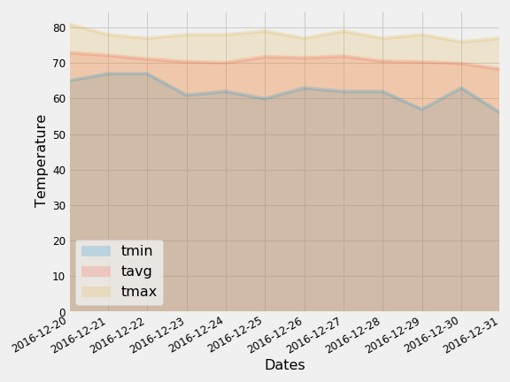

# sqlalchemy-challenge

# Background
[Project Details](project_instructions_README.md)

# Project Information
This project is broken up into the following sections:
### Climate Analysis and Exploration
    This was performed in the jupyter notebook climate.ipynb.  SQLAlchemy create_engine was utilized to connect to hawaii.sqlite data and `automap_base()` to reflect tables into classes with a reference to those classes called `Station` and `Measurement`.
    * Precipitation Analysis
      The last date in the dataset was obtained and then a date a year previous was calculated using 'relativedelta' from the dateutil library.  All of the precipitation data on or after the previous year calculated date and the following chart was created:

    The following are the descriptive statistics for the data used to generate this report:
    
  
    * Station Analysis
    The most active station in the dataset was obtained.   The following are the stations in most active order:
    
        The Most Active Stations in Descending Order
    --------------------------------------------
      Station   Count
    ----------- -----
    USC00519281  2772
    USC00519397  2724
    USC00513117  2709
    USC00519523  2669
    USC00516128  2612
    USC00514830  2202
    USC00511918  1979
    USC00517948  1372
    USC00518838   511

    The last date for the most active station (USC00519281) was obtained and then a date a year previous was calculated using 'relativedelta' from the dateutil library. The temperature data on or after the previous year calculated date was queried and the following chart was created:

    
  

### Climate App
    This logic is in the python program app.py.   This program can be executed using python. The welcome page can be accessed via http://127.0.0.1:5000/
    The following routes are available for this app:
    
| Route                               | Description    
| ----------------------------------- |-------------------- |
|  `/`                                | Lists all available routes.  | 
| `/api/v1.0/precipitation`           | Lists the final twelve months of precipitation amounts for all stations (date, prcp).|
| `/api/v1.0/stations`                | Lists information about all stations (station, name, longitude, latitude, elevation). |
| `/api/v1.0/tobs`                    | Lists the final twelve months of temperature data for the most active station (date, temperature). |
| `/api/v1.0/<start>`                 | Lists the min, max, average temperature from the given start date to the end of the dataset (start date, most active station min temp, max temp, average temp).  Date entry must be in the format yyyy-mm-dd. |
| `/api/v1.0/<start>/<end>`           | Lists the min, max, average temperature between the given start date and end date (start date, end date, most active station min temp, max temp, average temp).  Date entry must be in the format yyyy-mm-dd.  |

### Bonus
    This analysis was performed in the jupyter notebook climate.ipynb.  
    * Temperature Analysis I
    Analysis of June versus December, regardless of year, was performed.

    Null Hypothosis = There is no significant difference between the June and December temperatures 
    Alternative Hypothosis = There is significant differences between June and December temperatures

    In order to analyze, the temperatures from June of any year were obtained.  This was then also done for December temperatures.   From this analysis the following average information was obtained:
    
    The average June Temperature is 74.94
    The average December Temperature is 71.04

    An unpaired t-test (June and December two different populations) was then performed with the following result:

    Ttest_indResult(statistic=31.355036920962423, pvalue=4.193529835915755e-187)

    Since the P value is very close to zero this indicates strong evidence against the null hypothisis, so it should be rejected.¶

    * Temperature Analysis II
    A vacation time was chosen to be 12/20/2016 - 12/31/2016.   For this analysis, the dates for a year previous was calculated to then obtain max, min, and average temperatures from exactly a year before our chosen vacation dates.

    Our trip is scheduled for 2016-12-20 to 2016-12-31:
    We are using the previous year to compare 2015-12-20 to 2015-12-31
    Maximum Temperature = 79.0
    Minimum Temperature = 67.0
    Averge Temperature  = 73.21

    The following chart was created to represent this data:
  

    * Daily Rainfall Average
    The dates a year previous to your vacation of 12/20/2016 - 12/31/2016 was utilzed to calculate the total precipitation by station for those dates:
 |   	|Station	|Name	|Latitude	|Longitude	|Elevation	|Total Precipitation|
 |------|-----------|-------|-----------|-----------|-----------|-------------------|
|0	|USC00516128	|MANOA LYON ARBO 785.2, HI US	|21.33310	|-157.80250	|152.4	|6.34|
|1	|USC00519281	|WAIHEE 837.5, HI US	|21.45167	|-157.84889	|32.9	|3.03|
|2	|USC00513117	|KANEOHE 838.1, HI US	|21.42340	|-157.80150	|14.6	|1.91|
|3	|USC00519523	|WAIMANALO EXPERIMENTAL FARM, HI US	|21.33556	|-157.71139	|19.5	|0.96|
|4	|USC00519397	|WAIKIKI 717.2, HI US	|21.27160	|-157.81680	|3.0	|0.50|
|5	|USC00514830	|KUALOA RANCH HEADQUARTERS 886.9, HI US	|21.52130	|-157.83740	|7.0	|0.45|
|6	|USC00517948	|PEARL CITY, HI US	|21.39340	|-157.97510	|11.9	|0.00|

The the max, min, and average temperature was calculated for each date in the vacation regardless of year. (12/20, 12/21, 12/22, 12/23, 12/24, 12/24, 12/26, 12/27, 12/28, 12/29, 12/30, 12/31).  This data is then displayed as a prediction for our vacation days.  The following chart was created:
  