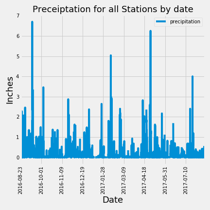

# sqlalchemy-challenge

# Background
[Project Details](project_instructions_README.md)

# Project Information
This project is broken up into the following sections:
### Climate Analysis and Exploration
    This was performed in the jupyter notebook climate.ipynb.  SQLAlchemy create_engine was utilized to connect to hawaii.sqlite data and `automap_base()` to reflect tables into classes with a reference to those classes called `Station` and `Measurement`.
    * Precipitation Analysis
      The last date in the dataset was obtained and then a date a year previous was calculated using 'relativedelta' from the dateutil library.  All of the precipitation data on or after the previous year calculated date and the following chart was created:

    The following are the descriptive statistics for the data used to generate this report:
    
  
    * Station Analysis
    The most active station in the dataset was obtained.   The following are the stations in most active order:
    
        The Most Active Stations in Descending Order
    --------------------------------------------
      Station   Count
    ----------- -----
    USC00519281  2772
    USC00519397  2724
    USC00513117  2709
    USC00519523  2669
    USC00516128  2612
    USC00514830  2202
    USC00511918  1979
    USC00517948  1372
    USC00518838   511

    The last date for the most active station (USC00519281) was obtained and then a date a year previous was calculated using 'relativedelta' from the dateutil library. The temperature data on or after the previous year calculated date was queried and the following chart was created:

    
  

### Climate App
    This logic is in the python program app.py.   This program can be executed using python. The welcome page can be accessed via http://127.0.0.1:5000/
    The following routes are available for this app:
    
| Route                               | Description    
| ----------------------------------- |-------------------- |
|  `/`                                | Lists all available routes.  | 
| `/api/v1.0/precipitation`           | Lists the final twelve months of precipitation amounts for all stations (date, prcp).|
| `/api/v1.0/stations`                | Lists information about all stations (station, name, longitude, latitude, elevation). |
| `/api/v1.0/tobs`                    | Lists the final twelve months of temperature data for the most active station (date, temperature). |
| `/api/v1.0/<start>`                 | Lists the min, max, average temperature from the given start date to the end of the dataset (start date, most active station min temp, max temp, average temp). |
| `/api/v1.0/<start>/<end>`           | Lists the min, max, average temperature between the given start date and end date (start date, end date, most active station min temp, max temp, average temp).  |

### Bonus
    This analysis was performed in the jupyter notebook climate.ipynb.  
    * Temperature Analysis I
    * Temperature Analysis II
    * Daily Rainfall Average